# NFL Regular Season Game Winner Prediction Final Report

## Group Members

Anshul Ahluwalia, David Kwon, Aditya Singh, Nishant Thangada, Ranveer Thind

## Video

https://youtu.be/tO3sUkU_sqk

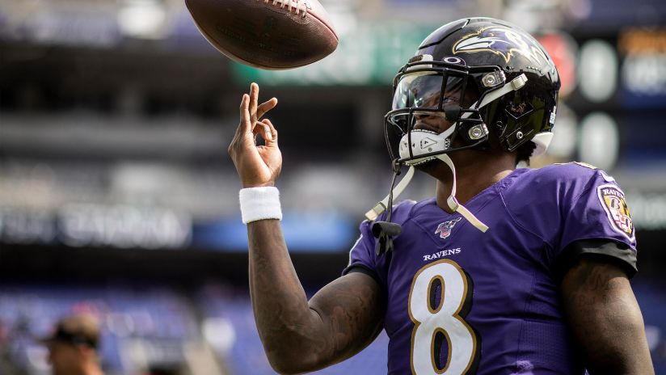

## Introduction / Background

The legal sports gambling market in the United States is worth \$238 million and the NFL is the largest sports league in the country. Suffice it to say, betting on the NFL is potentially a very lucrative endeavor. Our project seeks to help those bettors, by providing an accurate prediction of a team’s chance to win a given regular season NFL game. To provide context, the NFL stands for the National Football League and is constituted of 32 professional football teams that each play 16 regular season games a year. Our project aims to predict the winner of an NFL game given numerous offensive and defensive statistics for both teams heading into the game.

## Problem Definition

The problem we are seeking to solve is how can we provide a useful tool to sports bettors that will inform them of the winner of an NFL regular season game. Our solution is to create an accurate predictive model that provides an educated guess of how well a team will perform over the regular season. This will help sports bettors gain an understanding of how good a team is and how well they will perform against other teams in individual games.

## Data Collection

To obtain our data for this project, we primarily used [Pro Football Reference](https://www.pro-football-reference.com/)'s database. Pro Football Reference is known as one of the most complete sources of historical NFL data, so we felt quite confident using this website to collect our training data. Specifically, we decided to web scrape weekly team data for all the 32 NFL teams from the past 3 NFL Seasons (2017 - 2019). We limited our scope to this 3 year period, because we believe the NFL is an ever-changing landscape; furthermore, relying on recent game statistics and outcomes will surely enhance the accuracy of our model as we try to predict the winners of NFL games in 2020. Finally, after web scraping and combining each teams' weekly offensive and defensive statistics over 3 seasons, we resulted in 32 conglomerated csv files. With these compiled files for each team, our next step was to calculate the 5-game moving averages of every teams' weekly statistics (offensive and defensive) heading into regular season games. In order to craft our final training dataset, our next step was to gather every NFL team matchup for every week from 2017 to 2019. Now that we had every paired team matchup over the last 3 seasons and all the aggregated average statistics for 32 NFL teams, our last step was to essentially take every team matchup, join the averaged statistics for both teams heading into the week together, and append a column to represent the binary label of the winner of the matchup.

Here's a small snapshot of the weeks 6, 7, 8 of the 2017 season of our final training dataset:

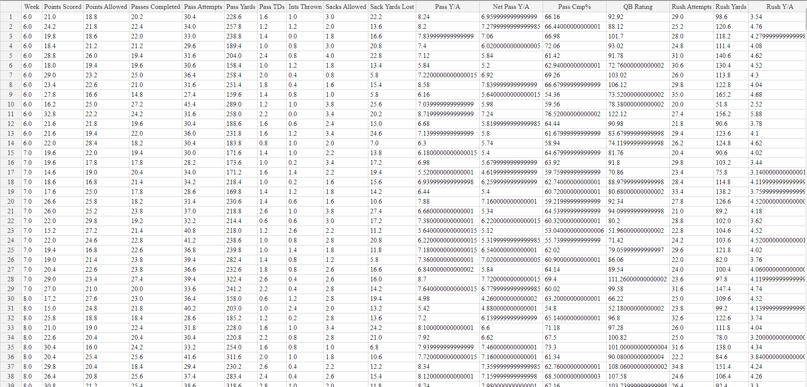

Our final training dataset was comprised of 692 rows (corresponding to 692 games played between 2017 and 2019) and 110 features. Every team had roughly 50 raw features that were averaged out, so when we paired 2 teams together for a game matchup, we resulted in 110 total features. We quickly noticed plenty of redundancy in many of the features, so we immediately proceeded to apply unsupervised learning technqiues (detailed below) to optimially reduce our feature space.

## Methods

In regards to our model training, we approached it with a two part process in mind. The first process would be to reduce the number of features that we would fit our model on as our initial dataset contained 110 features. Our first step was to use sklearn’s StandardScaler to scale down all our features as our features had drastically different ranges and ML models work best with standardized datasets. 

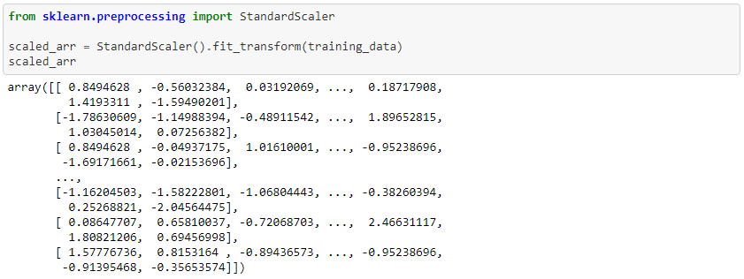

We then used PCA to reduce the number of features to 55 and discovered that this feature reduction explained 98.3% of the variance in our data. 

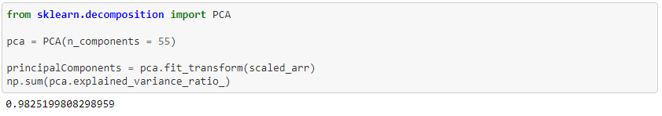

Now that our data had been scaled and we had performed dimensionality reduction to cut the number of features in half, we were ready to fit our models. First, we split our model into training and testing sets using sklearn’s train_test_split method.

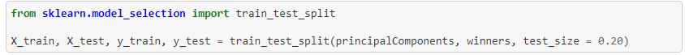

We then proceeded to experiment with several different models including Support Vector Machines, Decision Trees, Gradient Boosting Classifiers, Neural Networks and Random Forests. Our procedure for training the models was similar across different models due to Sklearn’s excellent modular implementations of the different types of Machine Learning Models. 

Our first step was in creating a method that would assess the efficacy of training models on both the training and testing data. As we are solving a classification problem, we created a method that would display both the confusion matrix and different classification metrics such as recall, precision and f-score.

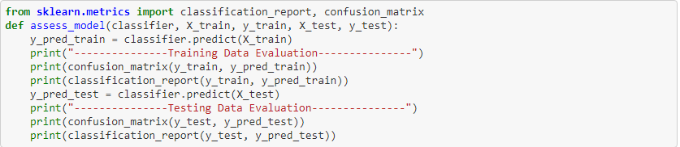

We then fit individual models and called this method on those classifiers. 

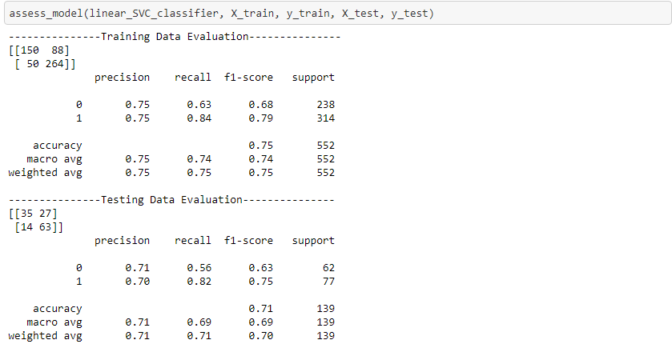

## Results

After fitting several models and assessing them, we found that three models performed well: Support Vector Machine with a polynomial kernel, Random Forest with 200 estimators, and a Lasso Regression model. Below is the result for the Support Vector Machine: 

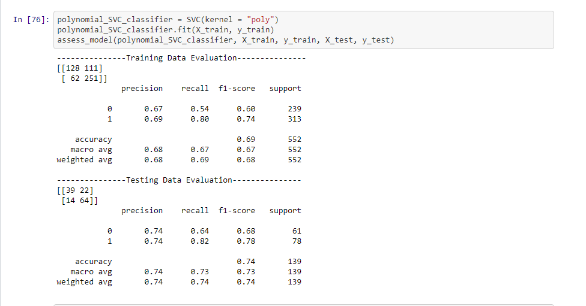

Below is the results for the Random Forest:

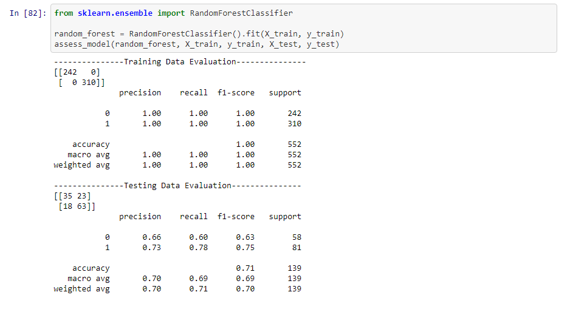
Below is the result for the Lasso Regression Model. When training the Lasso Regression model, to determine the best lambda value, we used the K-Fold Cross Validation method with K = 10. The optimal lambda value was calculated to be 0.0933.

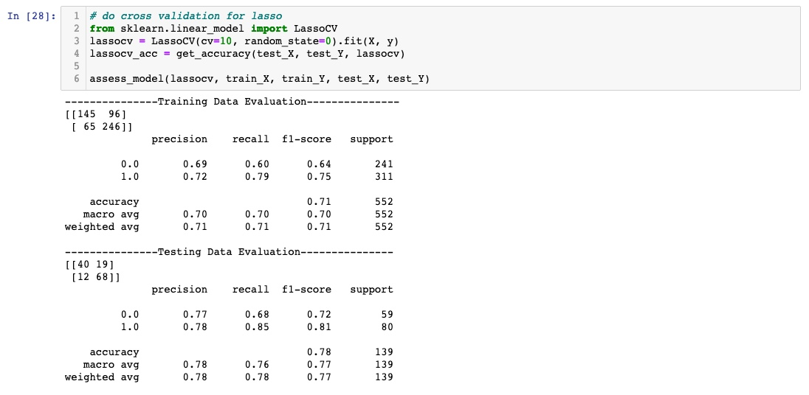

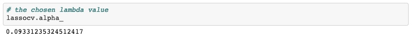

Surprisingly, training a Multi-Layer Perceptron on this data gave us inferior results compared to the previous three models. 

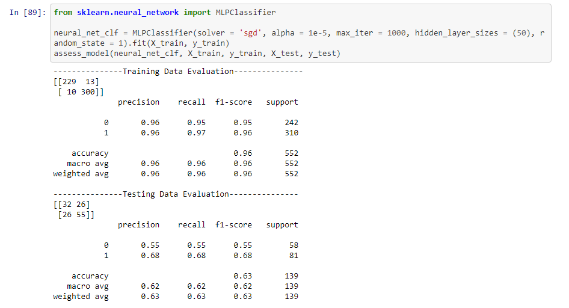

## Discussion

After extensive training and hyperparameter tuning, we discovered that the best models to use would be a LASSO regression model, a Support Vector Machine with a polynomial kernel, and a Random Forest with 200 different estimators. In hindsight, this seems to make intuitive logical sense. A LASSO Regression model would prevent overfitting due to its strong L1 regularization that penalizes less important features, SVMs are geared towards high-dimensional data due to the kernel trick that they use, so it’s no surprise that an SVM performed well on this dataset. Lastly, Random Forests seek to reduce overfitting through a process known as voting, so again it’s no surprise that a random forest model works well on a dataset with so many features. A neural network may have not worked too well as we had only 692 data points. Perhaps with more data, a neural network would have outperformed the other models that we trained.

## Conclusion

In conclusion, after collecting a mass of quality NFL game data and tailoring the feature space for our purposes, we reached promising results with a few different classification algorithms. While this project certainly holds ties to the world of sports betting, it’s important to acknowledge the overarching ethicality of this project, for using intelligent algorithms to make money in the betting world can certainly be perceived as an unfair advantage. Finally, we believe this project can be extended in numerous directions. One possible extension of this project would be to create a regression based model that predicts a numerical “spread” for an NFL matchup (since our current model simply predicts a winner). The methods employed in this project could also be applied to numerous other professional sporting industries, each with their own sports betting market. 

## References

Bosch, Pablo. “Predicting the Winner of NFL-Games Using Machine and Deep Learning.” _Vrije Universiteit Amsterdam_, Feb. 2018, pp. 1–20.

E. Davoodi, A. Khanteymoori “Horse racing prediction using artificial neural networks
Recent Adv. Neural Networks”, _Fuzzy Syst. Evol. Comput._, 2010, pp. 155-160

Uudmae, Jaak. “Predicting NBA Game Outcomes.” _Stanford CS229_, 2017, pp. 1–5.
